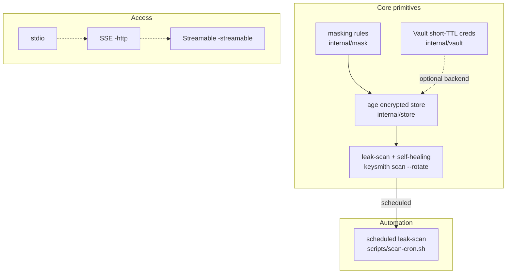

# keysmith 🔑

[English](README.md)

**AI エージェントのための key-smith** — シークレットを生成、保護、ローテーションし、平文がエージェントのコンテキストに入らないようにします。

Keysmith は、AI エージェントに安全なシークレット管理を提供する MCP サーバー兼 CLI です。マスキングを最後の防衛線と位置づけつつ、シークレット漏えいを構造的に防ぎます。保存時の暗号化、マスク済みビュー、ハンドル渡し、自己修復ローテーション、短 TTL の動的認証情報を備えています。

Go 製です。単一の静的バイナリで、ランタイム依存はありません。

## なぜ必要か

AI エージェントは作業のために、API キー、トークン、DB URL などの認証情報を必要とする場面が増えています。しかし、エージェントが `.env` ファイルを読むたびに、平文はコンテキスト、ログ、セッション履歴に永続的に漏れてしまいます。

Keysmith は、**多層セキュリティモデル**でこれを解決します。

| レイヤー | 仕組み | 防ぐもの |
|---|---|---|
| 暗号化された保存 | 保存時に age (X25519) で暗号化 | ディスク上の平文。コンテキストに漏れても blob は暗号文なので無害 |
| マスク済みビュー | resources/tools が `sk******ij` 形式で返す | 認証情報がエージェントのコンテキストに入ること |
| ハンドル渡し | `put` は transcript ではなく一時ファイル引数から値を読む | ツール呼び出し transcript 内の平文 |
| 自己修復ローテーション | `scan --rotate` が漏えいを検出し、漏れた値を無効化 | 古い漏えい済み認証情報が使われ続けること |
| 短 TTL (Vault) | 動的 DB 認証情報は 1 時間で期限切れ | 漏えいした認証情報の価値が残ること |

## インストール

```sh
go install github.com/sscodeai/keysmith/cmd/keysmith@latest
# またはソースからビルド
go build -o bin/keysmith ./cmd/keysmith
```

## 使い方

stdio transport でサーバーを起動します。これは標準的な MCP サーバーモードです。

```sh
keysmith -store ~/.keysmith
# または環境変数で指定:
KEYSMITH_STORE=/path/to/store keysmith
```

リモートエージェント向けに HTTP/SSE で提供します。

```sh
keysmith -store ~/.keysmith -http :8080
# endpoint: http://localhost:8080/sse
```

MCP 2025 Streamable HTTP で提供します。単一 POST エンドポイントのステートレス方式です。

```sh
keysmith -store ~/.keysmith -http :8080 -streamable
# endpoint: http://localhost:8080/mcp
```

HashiCorp Vault をバックエンドとして使用します。短 TTL の動的シークレットに対応します。

```sh
export VAULT_TOKEN=<token>
keysmith -store ~/.keysmith -vault http://127.0.0.1:8200
```

MCP クライアント、たとえば Claude Code や Cursor などで設定します。

```json
{
  "mcpServers": {
    "keysmith": {
      "command": "keysmith",
      "args": ["-store", "~/.keysmith"]
    }
  }
}
```

ストアディレクトリは初回実行時に `0600` 権限で作成され、次のファイルを保持します。

- `key.txt` — age 秘密鍵。共有しないでください。`0600` を維持してください
- `secrets.enc` — armor 形式の age 暗号化済みシークレット blob

## CLI

MCP サーバーに加えて、`keysmith` は同じストアを共有するスタンドアロン CLI としても動作します。

```sh
keysmith list                        # すべてのキーとマスク済み値
keysmith get API_KEY                 # マスク済み値
keysmith get API_KEY --unsafe        # 平文。最後の手段
keysmith set API_KEY < value.txt     # stdin から値を読み、shell history に残さない
keysmith rotate API_KEY 32           # 強力な新しいシークレットを生成して保存
keysmith delete API_KEY              # キーを削除
keysmith scan [--rotate] [repo-dir]  # git 履歴から漏えいしたシークレットをスキャン
```

Vault バックエンドのコマンドです。`-vault` と一緒に使います。

```sh
keysmith -vault http://127.0.0.1:8200 vault-kv-set API_KEY < value.txt
keysmith -vault http://127.0.0.1:8200 vault-kv-get API_KEY          # マスク済み
keysmith -vault http://127.0.0.1:8200 vault-kv-list
keysmith -vault http://127.0.0.1:8200 vault-db-creds app-role       # 短 TTL の動的 DB 認証情報
```

## Tools

| Tool | 説明 | セキュリティ特性 |
|---|---|---|
| `list` | すべてのキーとマスク済み値 | 値は平文にならない |
| `get` | 1 つのキーのマスク済み値 | 値は平文にならない |
| `put` | シークレットを保存 | 値は `value_file` 引数から読み、一時ファイルは自動削除 |
| `rotate` | 強力なランダムシークレットを生成して保存 | マスク済み値のみを返す |
| `delete` | キーを削除 | - |

## Resources

| URI | 説明 |
|---|---|
| `secret://secrets` | すべてのシークレットのマスク済みビュー。コンテキストに読ませても安全 |

## Agent skills

同梱の `SKILL.md` (`skill/` 内) は、すべてのシークレット操作をこのサーバー経由にするようエージェントへ教えます。`.env` を `cat` しない、トークンを echo しない、というルールです。リポジトリルートの `AGENTS.md` も、このコードベース上で作業するエージェント向けに同じルールを記述しています。

## Capability map

各部品の関係です。中核プリミティブと、その上に構築される自動化/transport レイヤーを示します。



| レイヤー | Capability | 関係 |
|---|---|---|
| Core | age store + mask + rotate + scan | 基盤となるプリミティブ |
| Automation | `scripts/scan-cron.sh` | `scan --rotate` をスケジュール実行 |
| Access | stdio / SSE / Streamable | 3 つの transport、1 つのサーバー |

**一言で言うと**: 中核プリミティブが力を提供し、自動化がそれを継続実行し、transport がエージェントの接続方法を決めます。

## セキュリティモデル

- **保存時**: 常に age (X25519) で暗号化され、armor 形式です。平文ファイルはディスク上に存在しません。atomic write (temp + rename) と `0600` 権限を使います。
- **コンテキスト内**: マスク済み値のみです。マスキングは先頭/末尾 2 文字を残し (`sk******ij`)、認証情報を識別できるが露出しない形にします。
- **Transcript 内**: `put` は平文を引数として受け取りません。一時ファイルパスを読み、読み取り後にファイルを削除します。
- **マスキング規則**: キー名マーカー (SECRET/TOKEN/PASSWORD/API_KEY/DSN...)、既知の値プレフィックス (sk-, ghp_, glpat-, xoxb-, JWT...)、高エントロピーな英数字列 (英字と数字が混在する 20 文字以上、Shannon entropy 3.5 以上) を使います。URL 形状の値はセグメントごとにマスクされます。userinfo のパスワードは常にマスクされ、高エントロピーな path/query はマスクされ、host/port は残ります。timeout や retry などの純数字値はマスクされません。

## 開発

```sh
go test ./...        # unit tests (mask + store + vault + leakscan)
go vet ./...         # static checks
python3 e2e_test.py  # MCP protocol の完全な round-trip
```

## 定期 leak-scan (cron self-healing)

同梱の `scripts/scan-cron.sh` は、1 つ以上のリポジトリに対して `keysmith scan --rotate` を実行します。漏えいが見つかり、ローテーションされた場合だけ 1 行を出力し、問題がなければ沈黙します。任意の cron に組み込めます。

```sh
# 6 時間ごとに 2 つの repo をスキャン。漏えい検出+ローテーション時だけ通知
0 */6 * * * /path/to/keysmith/scripts/scan-cron.sh ~/.keysmith /repo1 /repo2
```

## Roadmap

- [x] Vault backend (短 TTL の動的シークレット。漏えいした認証情報は期限切れになる)
- [x] HTTP/SSE transport (リモートエージェント向け)
- [x] CLI subcommands (MCP なしで add/get/rotate/scan)
- [x] Streamable HTTP transport (MCP 2025 標準、単一 POST エンドポイント)
- [x] Scheduled leak-scan watchdog script (cron 駆動の自己修復)
- [ ] Multi-tenant / team mode (audit log 付きでストアをエージェント間共有)
- [ ] Cloud credentials (AWS STS / GCP の短命認証情報)

## License

Apache-2.0
