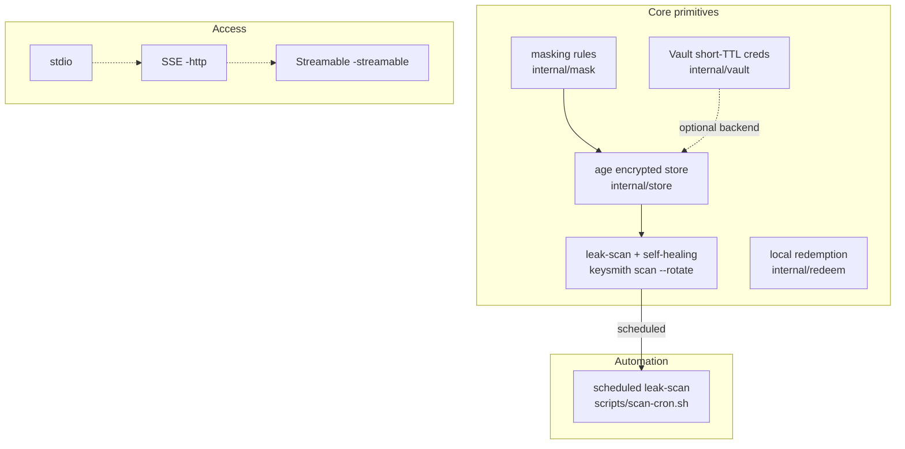

# keysmith 🔑

[日本語](README.ja.md)

**The key-smith for AI agents** — forge, guard, and rotate secrets so plaintext
never enters the agent's context.

Keysmith is an MCP server + CLI for AI-agent-safe secret management. It treats
masking as the last line of defense and works structurally to keep secrets
from leaking: encrypted residency, masked views, handle-passing, self-healing
rotation, and short-TTL dynamic credentials.

Masking alone leaves a gap: a masked value cannot be *used*. The redemption
layer closes it — the agent handles a non-secret token, and keysmith substitutes
the real value on this machine, into the environment of a command it starts.
The value is never in a model request, a tool result, a transcript, or an
argument list. See [docs/REDEEM.md](docs/REDEEM.md) and
[docs/THREAT-MODEL.md](docs/THREAT-MODEL.md).

Built with Go. Single static binary, zero runtime dependencies.

## Why

AI agents increasingly need credentials (API keys, tokens, DB URLs) to do
their work. But every time an agent reads a `.env` file, the plaintext leaks
into its context, logs, and session history — permanently.

Keysmith fixes this with a **layered security model**:

| Layer | Mechanism | What it prevents |
|---|---|---|
| Encrypted residency | age (X25519) encrypted store at rest | Plaintext on disk; even a leaked context is harmless (blobs are ciphertext) |
| Masked views | resources/tools return `sk******ij` form | Credentials entering agent context |
| Handle-passing | `put` reads value from a temp file arg, not the transcript | Plaintext in tool-call transcripts |
| Self-healing rotation | `scan --rotate` detects leaks, kills the leaked value | Stale leaked credentials keep working |
| Short-TTL (Vault) | dynamic DB creds expire in 1h | Leaked credentials become worthless |
| Redemption | `keysmith run` substitutes a token locally, into the child's environment | An agent that must *use* a credential being tempted to print it; plaintext in `argv`, transcripts, or logs |

## Install

```sh
go install github.com/sscodeai/keysmith/cmd/keysmith@latest
# or build from source
go build -o bin/keysmith ./cmd/keysmith
```

## Usage

Run the server on stdio transport (the standard MCP server mode):

```sh
keysmith -store ~/.keysmith
# or via env:
KEYSMITH_STORE=/path/to/store keysmith
```

Serve over HTTP/SSE for remote agents:

```sh
keysmith -store ~/.keysmith -http :8080
# endpoint: http://localhost:8080/sse
```

Serve MCP 2025 Streamable HTTP (single POST endpoint, stateless):

```sh
keysmith -store ~/.keysmith -http :8080 -streamable
# endpoint: http://localhost:8080/mcp
```

Use HashiCorp Vault as the backend (dynamic short-TTL secrets):

```sh
export VAULT_TOKEN=<token>
keysmith -store ~/.keysmith -vault http://127.0.0.1:8200
```

Configure it in your MCP client (Claude Code, Cursor, etc.):

```json
{
  "mcpServers": {
    "keysmith": {
      "command": "keysmith",
      "args": ["-store", "~/.keysmith"]
    }
  }
}
```

The store directory is created on first run with `0600` permissions, holding:

- `key.txt` — your age private key (NEVER share; keep `0600`)
- `secrets.enc` — armored age-encrypted secrets blob

## CLI

In addition to the MCP server, `keysmith` works as a standalone CLI sharing the same store:

```sh
keysmith list                        # all keys, masked values
keysmith get API_KEY                 # masked value
keysmith get API_KEY --unsafe        # plaintext (last resort)
keysmith set API_KEY < value.txt     # value from stdin, no shell-history leak
keysmith rotate API_KEY 32           # generate + store new strong secret
keysmith delete API_KEY               # remove a key
keysmith scan [--rotate] [repo-dir]  # scan git history for leaked secrets
keysmith token API_KEY               # issue a session-bound placeholder token
keysmith run --env AUTH="Bearer <token>" -- sh -c 'curl -H "Authorization: $AUTH" https://…'
```

## Use a credential without reading it

The agent never needs the plaintext to *use* a credential:

```sh
TOKEN=$(keysmith token API_KEY)                 # token on stdout, session info on stderr
keysmith run --env AUTH="Bearer $TOKEN" -- sh -c 'curl -s -H "Authorization: $AUTH" https://api.example.test/me'
```

- `TOKEN` is a reference, not a secret: `[[keysmith:v1:API_KEY:8f3a2b1c]]`. It only
  resolves locally, only while the issuing session is alive, and only for the
  names issued in it.
- The real value is substituted on this machine and placed in the child's
  environment. It never enters a model request, a transcript, or `argv`.
- A token in the command arguments is refused, because `argv` is readable by
  every user via `ps`. Put it in `--env` and let the child's shell expand it.
- Redemption fails closed: unknown or expired session, a name not issued in that
  session, a missing value, a malformed token, or an unwritable audit log all
  abort before the command starts. No fallback ever forwards a literal token or
  a plaintext value.
- `<store>/audit.log` records the key *names*, the command basename and the
  argument count — never a value and never a full argument list.

Full details, including the token grammar and the fail-closed table:
[docs/REDEEM.md](docs/REDEEM.md).

Vault-backed commands (with `-vault`):

```sh
keysmith -vault http://127.0.0.1:8200 vault-kv-set API_KEY < value.txt
keysmith -vault http://127.0.0.1:8200 vault-kv-get API_KEY          # masked
keysmith -vault http://127.0.0.1:8200 vault-kv-list
keysmith -vault http://127.0.0.1:8200 vault-db-creds app-role       # dynamic short-TTL DB creds
```

## Tools

| Tool | Description | Security property |
|---|---|---|
| `list` | All keys with masked values | Values never plaintext |
| `get` | Single key, masked value | Values never plaintext |
| `put` | Store a secret | Value read from `value_file` arg, temp file auto-removed |
| `rotate` | Generate + store a new strong random secret | Returns masked value only |
| `delete` | Remove a key | — |

## Resources

| URI | Description |
|---|---|
| `secret://secrets` | Masked view of all secrets (safe to read into context) |

## Agent skills

The bundled `SKILL.md` (in `skill/`) teaches agents to route ALL secret
operations through this server — never `cat` a `.env`, never echo a token.
The `AGENTS.md` at the repo root encodes the same rules for agents working
on this codebase itself.

## Capability map

How the pieces relate — core primitives vs the automation/transport layers
built on top of them:



| Layer | Capability | Relationship |
|---|---|---|
| Core | age store + mask + rotate + scan + redeem | foundational primitives |
| Automation | `scripts/scan-cron.sh` | schedules `scan --rotate` |
| Access | stdio / SSE / Streamable | three transports, one server |

**One line**: core primitives provide the power, automation makes it run by
itself, transports decide how agents connect.

## Security model

- **At rest**: always age-encrypted (X25519), armor format. A plaintext file
  never exists on disk. Atomic writes (temp + rename), `0600` perms.
- **In context**: masked values only. Masking keeps first/last 2 chars
  (`sk******ij`) so credentials are distinguishable without being revealed.
- **In transcripts**: `put` never takes the plaintext as an argument — it
  reads a temp file path and deletes the file after.
- **At use time**: `keysmith run` redeems a session-bound token locally and
  places the value in the child's environment. Values never reach `argv`, the
  audit log, or a model request; every failure aborts before the command starts
  (no plaintext fallback, no literal-token fallback).
- **Masking rules**: key-name markers (SECRET/TOKEN/PASSWORD/API_KEY/DSN...),
  known value prefixes (sk-, ghp_, glpat-, xoxb-, JWT...), and high-entropy
  alphanumeric runs (≥20 chars mixing letters+digits, Shannon entropy ≥3.5).
  URL-shaped values are masked per-segment: userinfo password always masked,
  high-entropy path/query runs masked, host/port stay clear. Pure-numeric
  values (timeouts, retries) are never masked.

## Development

```sh
go test ./...            # unit tests (mask + store + vault + leakscan + redeem)
go vet ./...             # static checks
python3 e2e_test.py      # full MCP protocol round-trip
python3 verify_redeem.py # redemption: child env vs /proc, fail-closed cases, audit log
```

## Boundaries

keysmith narrows the paths a credential can take; it does not make an untrusted
machine safe. Specifically:

- Any process running as your user can read `key.txt` and decrypt the store.
  `0600`/`0700` permissions do not isolate same-UID processes.
- The bundled agent skill is **guidance, not access control**: nothing stops an
  agent from `cat`-ing a file that was never in the store. The enforced paths are
  the store API, the masked views, and the redemption layer.
- Masking discloses the first and last two characters of a value
  (`sk******ij`) so credentials stay distinguishable — a deliberate, small
  disclosure.
- Masked views and the leak-scanner are best-effort detection, not proof: a
  value that is never matched is never masked.

The full adversary list, including what is explicitly out of scope, is in
[docs/THREAT-MODEL.md](docs/THREAT-MODEL.md).

## Scheduled leak-scan (cron self-healing)

The bundled `scripts/scan-cron.sh` runs `keysmith scan --rotate` on one or
more repos, printing one line only when leaks are found (and rotated) —
silent when clean. Wire it into any cron:

```sh
# every 6 hours, scan two repos; only alerts when leaks found+rotated
0 */6 * * * /path/to/keysmith/scripts/scan-cron.sh ~/.keysmith /repo1 /repo2
```

## Roadmap

- [x] Vault backend (dynamic short-TTL secrets — leaked credentials expire)
- [x] HTTP/SSE transport (for remote agent scenarios)
- [x] CLI subcommands (add/get/rotate/scan without MCP)
- [x] Streamable HTTP transport (MCP 2025 standard, single POST endpoint)
- [x] Scheduled leak-scan watchdog script (cron-driven self-healing)
- [x] Local redemption layer (session-bound tokens resolved locally; fail-closed, value-free audit log)
- [ ] Multi-tenant / team mode (share store across agents with audit log)
- [ ] Cloud credentials (AWS STS / GCP short-lived)

## License

Apache-2.0
